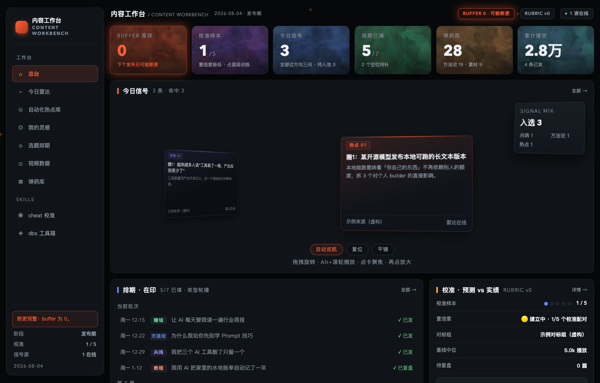
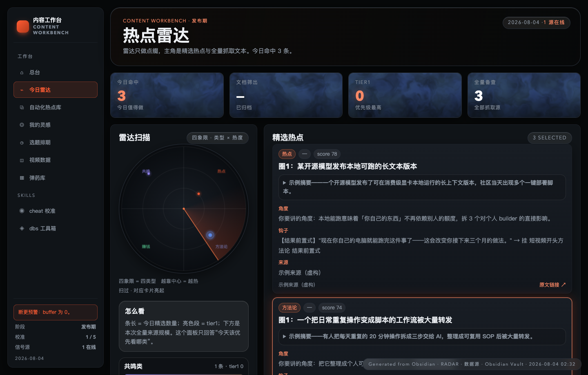
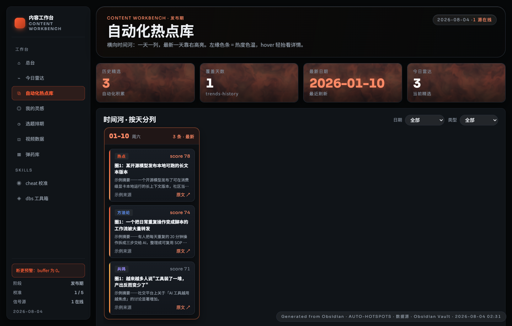
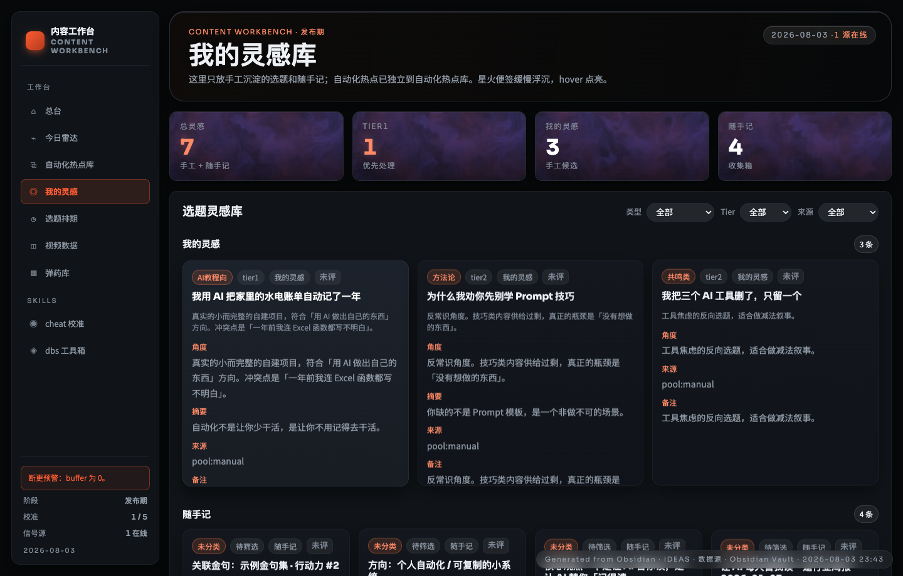
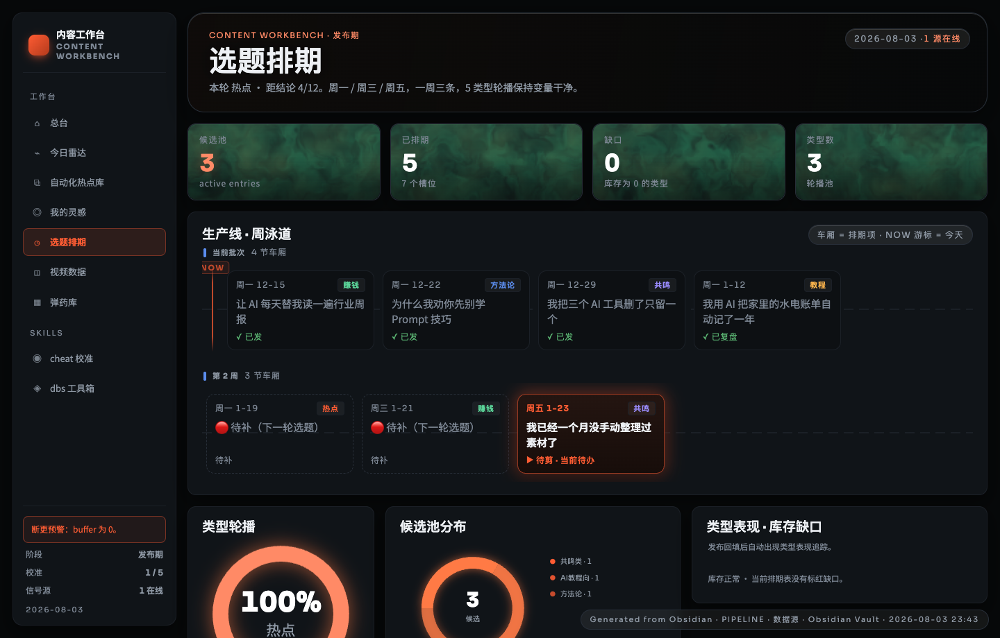
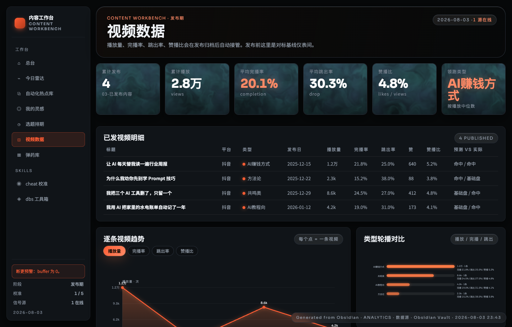
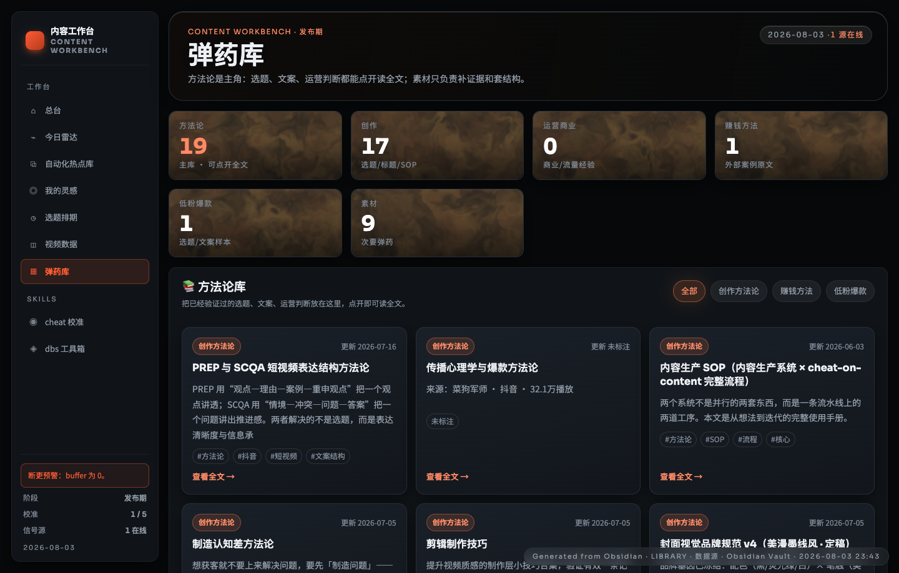
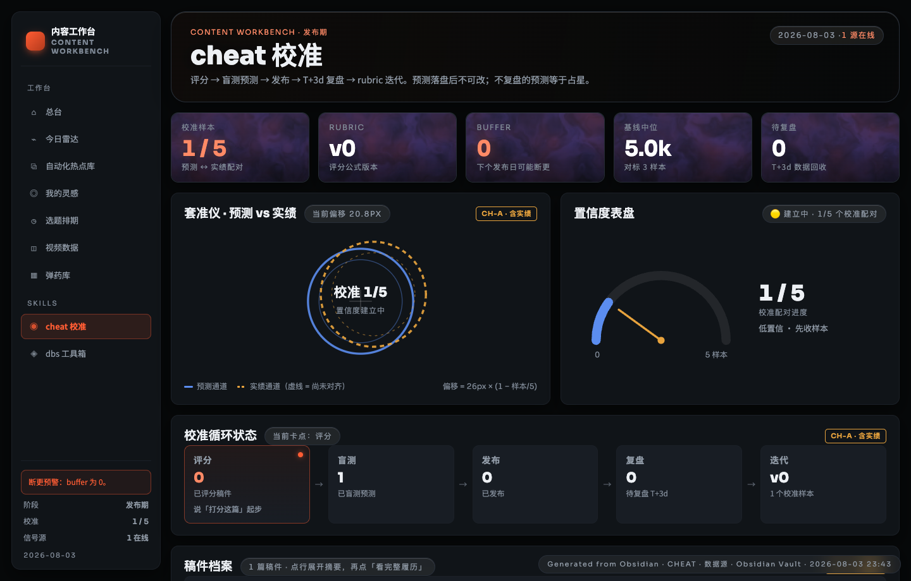
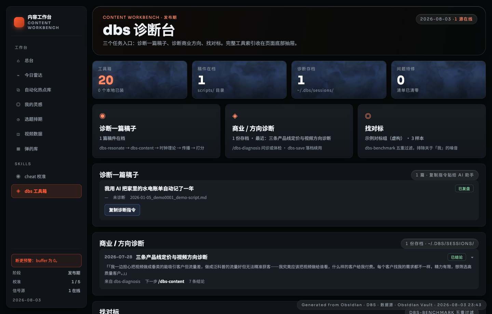

<div align="center">

# obsidian-creator-workbench

**把短视频创作从「灵感来了写一条」变成一条能追踪、能复盘、能沉淀的流水线。**

整套系统跑在一个 Obsidian vault 里，全是 `.md` 文件——没有数据库、不用注册、不用装依赖。
配一个零依赖的本地工作台：读你的笔记，生成 9 个页面的看板。

</div>



> 上图是仓库自带的**虚构示例数据**（账号、选题、播放量全是编的）。
> clone 下来就是这个样子，不需要你先有内容。

---

## 目录

- [它解决什么问题](#它解决什么问题)
- [30 秒看到效果](#30-秒看到效果)
- [九个页面，各管一件事](#九个页面各管一件事)
- [一条内容的完整走法](#一条内容的完整走法)
- [换成你自己的内容](#换成你自己的内容)
- [和 AI 一起用](#和-ai-一起用)
- [17 篇方法论都讲了什么](#17-篇方法论都讲了什么)
- [常见问题](#常见问题)

---

## 它解决什么问题

如果你在做内容，下面几条大概率戳中过你：

| 你的处境 | 这套系统怎么接住 |
|---|---|
| 写完就忘，每条都从零开始 | 概念、金句、案例、爆款结构分门别类存着，写新稿前先翻库，能复用就不重写 |
| 「这条应该会火吧」——凭感觉 | 发布**前**先打分、先写下流量预测；发布后回填真实数据，逼你面对自己判断力的偏差 |
| 复盘停在「这条数据还行」 | 预测 vs 实绩逐条对照，偏差方向连续 3 次一致才允许改评分标准，避免一次波动就推翻方法 |
| 方法论在脑子里，写的时候想不起来 | 17 篇成文方法论躺在库里，AI 写稿时直接按它们搭骨架 |
| 不知道今天该干什么 | 工作台按每篇稿子的状态排出下一步动作：该打分的、该拍的、该复盘的 |
| 没素材可做 | 内置零依赖热点抓取器（HN / GitHub / RSS），抓完让 AI 过一遍方向三问挑出能做的 |
| 想做类型实验但记不住做过什么 | 5 类内容固定轮播，每类的样本数和中位数据自动汇总 |

**一句话**：它不帮你写得更快，它帮你不重复犯同一个错。

---

## 30 秒看到效果

```bash
git clone https://github.com/fengjunchengCode/obsidian-creator-workbench.git
cd obsidian-creator-workbench/dashboard
python3 build.py     # 读上一级目录的示例内容，生成 9 个页面
python3 serve.py     # 打开 http://127.0.0.1:8000
```

只要 Python 3.9+，**没有任何第三方依赖**，不用 pip install。

生成的是纯静态 HTML，双击 `dashboard/index.html` 也能直接看，不起服务也行。

---

## 九个页面，各管一件事

设计原则是：**每个页面只回答一个问题**，不做万能仪表盘。

### 1. 总台 — 「今天整体什么情况」


一进来先看六个数：库存还剩几条、校准到第几个样本、今天有几条信号、排期填了多少、素材库多厚、累计播放。
左下角常驻一块预警区，库存为 0 会直接标红提醒「下个发布日可能断更」。

中间那个转盘是今日热点信号，可以拖着转、点开看详情。

**什么时候看它**：每天开工第一眼。

---

### 2. 今日雷达 — 「今天值得做什么」



每条热点信号都带齐四样东西：**原文摘要、来源链接、你要讲的角度、现成的钩子**——
钩子还标了用的是开头方法论里的哪一式（结果前置 / 痛点 / 反常识……）。

左边雷达图的四个象限对应四类选题，越靠中心越热，一眼看出今天该优先做哪类。

**数据怎么来的**（两步，都不需要 API key、不需要定时任务）：

```bash
python3 tools/fetch_trends.py     # ① 抓原文（Hacker News / GitHub / 任意 RSS）
# ② 对 AI 说「刷新热点雷达」：过方向三问 → 挑选 → 补角度和钩子
cd dashboard && python3 build.py  # ③ 重建
```

拆两步是故意的：**抓取是确定性的，判断不是。**「值不值得做、从什么角度切、开头怎么钩」
依赖你的账号方向，脚本自动生成只会产出模板话术。详见 [`docs/热点刷新流程.md`](docs/热点刷新流程.md)。

**什么时候看它**：选题荒的时候。这页的目的是让「我没素材可做」这句话消失。

---

### 3. 自动化热点库 — 「上周那条热点还找得回来吗」



每次刷新雷达时选中的条目会归档成历史，按日期堆起来。热点会过期，但**热点背后的角度不会**——
三个月前你没做的那条，换个时机可能正合适。

数据来源同上：`fetch_trends.py` 抓原文 → AI 挑选并加工 → 写进 `trends-history/YYYY-MM-DD.md`。
**这一页只是渲染层**，你不刷新它就不会自己长出内容。

**什么时候看它**：想找一个「还没人做透」的旧题时。

---

### 4. 我的灵感 — 「我自己想到过什么」



这页**只放你手工沉淀的东西**，自动抓的热点一律不混进来——这条边界很重要，
否则你自己的想法会被机器产出的噪音淹没。

分两栏：**我的灵感**（想清楚了的候选，带类型、优先级、角度、摘要）和**随手记**（还没想清楚的一句话）。
右上三个下拉可以按类型、优先级、来源筛。

**什么时候看它**：写稿前挑题；以及每周清一次随手记，把想明白的升级成候选。

---

### 5. 选题排期 — 「接下来三条发什么」



中间那条「周泳道」是排期主视图，每节车厢是一条内容，标着发布日、类型、状态（待剪 / 已拍 / 已发 / 已复盘），
`NOW` 游标指着今天。红点是**空位**——提醒你这个槽还没填，再不补就要断更。

下面是类型轮播的分布和候选池构成。轮播的意义是**让「类型」成为唯一变量**：
时长、发布时间、封面风格都固定，这样几周之后才分得清是「类型」还是别的因素在影响数据。

**什么时候看它**：每周排期时；以及任何时候想知道「我还差几条」。

---

### 6. 视频数据 — 「发出去之后到底怎么样」



已发内容的明细表 + 逐条趋势 + 类型轮播对比。播放、完播、跳出、赞播比都在，
最右边一列是**预测 vs 实际**——这是整套系统里最值钱的一列。示例里四条的战绩是
`命中/命中`、`命中/基础盘`、`基础盘/命中`、`基础盘/命中`：**四次押对两次**，
这就是「你以为的爆款」和「实际的爆款」之间的距离，看得见才改得动。

右下角的类型轮播对比会把每类的播放 / 完播 / 跳出并排画出来。
但请留意示例的样本量：4 个类型各只有 1 条。**每类至少 2-3 条才谈得上比较**，
一条样本得出的「领跑类型」只是噪音。

**什么时候看它**：发布后 24 小时、7 天各一次。

---

### 7. 弹药库 — 「有没有现成的能用」



方法论、素材、案例、赚钱方法、低粉爆款样本全在这。**方法论是主角**，点开就能在页面里读全文，
不用切回 Obsidian。上面按分类筛，卡片上有标签和更新日期。

**什么时候看它**：写稿卡住的时候；以及做选题判断拿不准的时候。

---

### 8. cheat 校准 — 「我的判断力准不准」



这页是整套系统的方法论核心：**评分 → 盲测预测 → 发布 → T+3d 复盘 → 迭代评分标准**。

- 左边「套准仪」用两个圈表示预测通道和实绩通道，**没对齐就是你还没校准**，偏移量写在旁边
- 右边表盘是校准进度：示例里 1/5，标着「低置信 · 先收样本」
- 下面是循环状态机，标出当前卡在哪一步、下一句该对 AI 说什么（比如「说『打分这篇』起步」）

关键纪律有两条，都不是建议而是强制：**预测写完不可改**（有 hook 拦截），
**连续 3 次同方向偏差才允许改评分公式**（一次波动不算数）。

> 页面顶部那句话是这套东西的立场：「预测落盘后不可改；不复盘的预测等于占星。」

**什么时候看它**：每次发布前和复盘后。

---

### 9. dbs 工具箱 — 「有哪些现成的诊断可以用」



一组商业 / 内容诊断 skill 的入口面板，以及历史诊断存档。

---

## 一条内容的完整走法

下面是示例数据里那条「我用 AI 把家里的水电账单自动记了一年」实际走过的流程，
每一步都对应你会打开的页面：

| # | 你在做什么 | 打开哪页 | 系统留下什么 |
|---|---|---|---|
| 1 | 冒出一个想法 | — | 一句话进「随手记」 |
| 2 | 想清楚了，升级成候选 | 我的灵感 | 带类型、角度、摘要的候选卡 |
| 3 | 排进下周三 | 选题排期 | 泳道上多一节车厢，空位 -1 |
| 4 | 写稿 | 弹药库 | 稿子里用双链引用了复用的概念和金句 |
| 5 | **打分 + 写下预测** | cheat 校准 | 一份**不可修改**的预测日志：7 维分数、押哪个流量档、押错了说明什么 |
| 6 | 拍、发 | 选题排期 | 状态推进到「已发」 |
| 7 | **T+3 天回填真实数据** | 视频数据 → cheat 校准 | 预测 vs 实绩对照，偏差方向入账 |
| 8 | 偏差攒够 3 次同方向 | cheat 校准 | 才允许动评分公式，并留下备忘录 |

第 5 步和第 7 步是这套系统区别于「一个好看的看板」的地方。
**只做 1-4 步，你只是把混乱整理得更好看了；做了 5 和 7，你的判断力才会随时间变准。**

---

## 换成你自己的内容

### 方式一：把这个仓库当成你的 vault（推荐新手）

1. 用 Obsidian 打开仓库根目录
2. 装两个插件：**Dataview**（看板查询）和 **Templater**（模板）
3. 删掉示例内容：`01-` 到 `08-` 各目录下的示例文件，以及 `predictions/`、`scripts/`、`videos/`、`trends-history/`
4. **保留** `05-方法论沉淀/` 和 `templates/`——那是方法，不是数据
5. 把 `candidates.md`、`audience.md`、`benchmark.md` 换成你自己的
6. 打开 `.gitignore`，取消底部几行私人内容目录的注释，免得哪天手滑推上去
7. 改 `CLAUDE.md` 开头的平台、赛道、定位

### 方式二：保持你现有的 vault，只用工作台

```bash
cd dashboard
python3 build.py --vault ~/你的/vault路径 --out ~/输出目录
```

你的目录结构需要和这里对得上（`01-内容生产/`、`02-素材库/`……）。
缺文件不会崩溃，只会少显示一块——**边搬边建**完全可行，不用一次搞完。

各文件该长什么样，见 [`docs/数据契约.md`](docs/数据契约.md)。

### 让它每天自动刷新（macOS，可选）

```bash
bash 06-业务运营/cron/install-public-workbench-launchagents.sh
```

装完会常驻后台，定时重建 + 起本地服务。

> ⚠️ **默认只监听本机。** 如果你打算放到公网，先自己加访问控制——
> 页面里内嵌了你 vault 的全量数据。

---

## 和 AI 一起用

这套系统是为「你 + 一个 AI 助手」两个人协作设计的。
仓库里的 `CLAUDE.md` 就是给 AI 读的说明书（Codex 读 `AGENTS.md`，它会指向同一份）。

在仓库目录下打开 Claude Code 或 Codex，直接说人话就行：

| 你说 | 它做什么 |
|---|---|
| 「刷新热点雷达」 | 读抓取到的原文，逐条过方向三问，挑出方向内的，补角度和钩子 |
| 「记录选题：程序员反而做不好 Vibe Coding」 | 追加到选题收集箱，不评判好坏 |
| 「深化这个选题」 | **先过方向三问**（不过就直说不做），再翻素材库找可复用的，然后按方法论搭骨架写稿 |
| 「起个标题」 | 按标题方法论出 3 个选项，每个都说明为什么这么起 |
| 「优化开头」 | 按开头 6 式改前 5 秒，并标出用的是哪一式 |
| 「检查节奏」 | 把稿子切成 12 个刻度区，找出哪一段是冷区，逐处给改法 |
| 「打分这篇」 | 7 维打分 + 综合分 + 改稿优先级 |
| 「复盘」 | 回填数据、对照预测、把发现写进备忘录 |

装了仓库自带的两个 hook 之后（`.claude/settings.json` 已配好）：

- **每次会话开始**自动汇报当前状态：库存几条、哪篇待复盘、上次抓热点是几天前
- **改到已完成的预测段时直接拦下来**——保护你的盲预测不被事后美化

> 评分 / 预测 / 复盘那套循环来自独立项目 [cheat-on-content](https://github.com/XBuilderLAB/cheat-on-content)，
> 本仓库只包含**适配层和工作流约定**，不分发它本身，按它的说明单独装。

---

## 17 篇方法论都讲了什么

`05-方法论沉淀/` 是这个仓库里唯一「不是示例」的部分——全是实践总结的正文。

| 分组 | 篇目 |
|---|---|
| **进来之前** | 选题方法论、账号方向优先方法论、小红书标题方法论、短视频开头方法论 |
| **进来之后**（正文质量） | 短视频文案节奏方法论（时钟理论）、爆款口播内容设计方法论、爆款内容三要素方法论、PREP 与 SCQA 表达结构方法论、制造认知差方法论、传播心理学与爆款方法论 |
| **发出去之后** | 抖音发布时间方法论、爆款视频流量承接方法论、抖加投放方法论、抖加定向与复投方法论 |
| **制作** | 封面制作规范、剪辑制作技巧 |
| **流程** | 内容生产 SOP |

其中「时钟理论」是唯一管**正文节奏**的标尺：把视频切成 12 个刻度区，
检查每个区是否都有信息点、3/6/9/12 是否有阶段推进、哪里是硬冷区。
其他方法论大多只管「用户点进来之前」，这一篇管「点进来之后为什么不划走」。

> **重要**：这些是作者在自己账号上的实践总结，**不是被大样本验证过的结论**。
> 当成假设用，用你自己的数据去证伪。有几篇内部还明确标着「样本不足，只记录观察，不升级为方法论」。

---

## 常见问题

**Q：一定要用 Obsidian 吗？**
不是。所有内容都是普通 Markdown，用任何编辑器都行。Obsidian 提供的是双向链接和 Dataview 查询，
不用的话工作台照样能构建。

**Q：我不做短视频，做公众号 / 播客能用吗？**
主干（选题池 → 排期 → 打分 → 预测 → 复盘）是通用的。
钩子、时钟理论、完播率这些是短视频特有的，需要换成你自己的指标。

**Q：为什么示例数据里播放量都不高？**
故意的。这套东西是为「还在找感觉的阶段」设计的——那个阶段最需要的不是爆款技巧，
而是**先把判断力校准到能相信自己的判断**。示例里连校准进度都只有 1/5，
页面上明写着「低置信 · 先收样本」。

**Q：页面为什么是暗色的、还带动效？**
它被设计成一个「工作台」而不是一份报表：你每天要盯很久，暗色更耐看。

**Q：会不会把我的内容传到哪里去？**
不会。**你的内容一个字节都不出本机。**
构建、渲染、打分、复盘全程离线，工作台是静态 HTML，用 `file://` 打开都能跑。

唯一会联网的是可选的热点抓取器 `tools/fetch_trends.py`，而它只做**出站读取**——
向你自己配置的公开地址（Hacker News、GitHub、你填的 RSS）发 GET 请求拿数据，
不发送、不上传你 vault 里的任何东西。不想联网就别跑它，其余功能完全不受影响。

**Q：仓库里的示例内容是真的吗？**
不是，全部虚构。账号、选题、播放量、评论都是编的，不对应任何真实账号。
方法论正文是真的，但其中引用的对标账号和真实案例数据已经匿名化或移除。

**Q：我改了代码，怎么提交？**
欢迎提 Issue 和 PR，但请先读 [`docs/与上游同步.md`](docs/与上游同步.md)——
这个仓库是从作者的私有 vault 单向导出的，你的 PR 会以「回捡进上游、随下次导出流回来」的方式落地。

---

## 更多文档

- [快速开始](docs/快速开始.md) — 三种用法的详细步骤
- [热点刷新流程](docs/热点刷新流程.md) — 雷达数据从哪来、抓取器怎么配、AI 怎么加工
- [数据契约](docs/数据契约.md) — 工作台读哪些文件、每个文件该怎么写
- [与上游同步](docs/与上游同步.md) — 这个仓库是怎么维护的、没包含什么

## License

MIT，见 [LICENSE](LICENSE)。

方法论正文同样按 MIT 释出，随便用、随便改。如果它对你有用，
最好的回馈是**把你用自己数据验证或证伪的结果发个 Issue 告诉我**——
这套东西最缺的就是别人账号上的样本。
